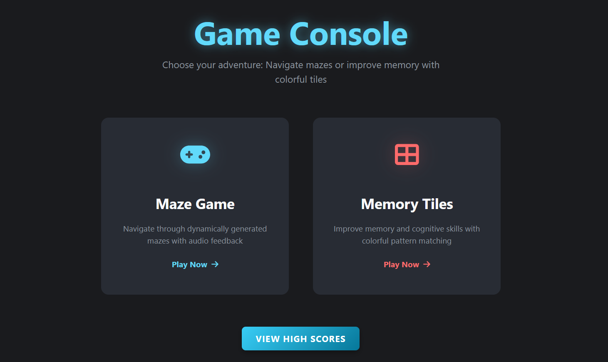
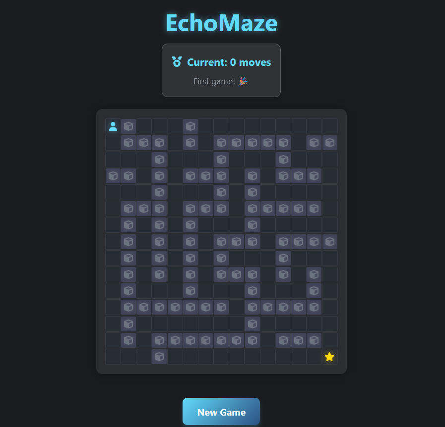
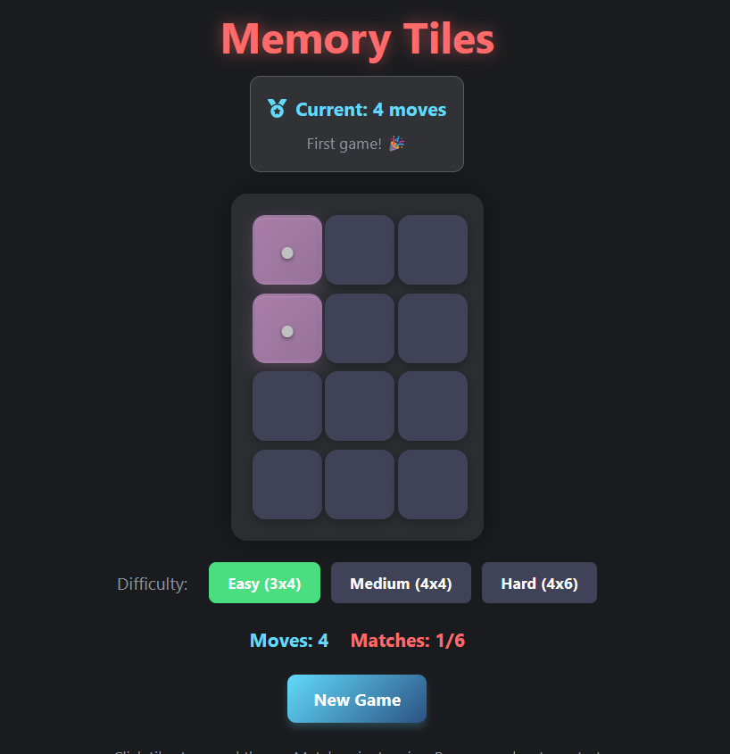

# 🎮 Game Console

> **An inclusive gaming platform for the visually impaired**, featuring voice-controlled puzzles, audio-guided mazes, and leaderboard tracking — all delivered through a sleek web interface.

Built with ❤️ using **FastAPI**, **React + Vite**, and advanced **speech + vision** technology.

---

## 🧠 What’s Inside?

* 🧩 **Maze Game** with real-time **audio guidance**
* 🗣️ **Tile Game** using **voice commands**
* 🔐 **Secure Google OAuth login** with **JWT-based session management**
* 📊 **Global and personal leaderboards**
* 💬 Powered by **ElevenLabs TTS/STT** for full accessibility
* 🌐 Fully **responsive UI** and accessible UX

---

## 📸 Game Console Preview



---

## 🚀 Tech Stack

| Layer          | Technology                                             |
| -------------- | ------------------------------------------------------ |
| **Backend**    | Python 3.13, FastAPI, JWT, OAuth2 (Google)             |
| **Frontend**   | Node.js 24, React + Vite, TypeScript                   |
| **Database**   | MongoDB Atlas (Cloud NoSQL)                            |
| **Speech**     | [ElevenLabs](https://www.elevenlabs.io/) for STT & TTS |
| **Deployment** | Docker, Docker Compose, Nginx                          |

---

## 🛠️ Getting Started

### 🔁 Prerequisites

* **Python** 3.13+
* **Node.js** 24.x+
* **npm** 9+

---

### 🐍 Backend Setup (FastAPI)

```bash
cd backend
python3.13 -m venv venv
source venv/bin/activate
pip install -r requirements.txt
python3 app.py
```

Visit [http://localhost:8000/docs](http://localhost:8000/docs)

---

### 🌐 Frontend Setup (React + Vite)

```bash
cd frontend
npm install
npm run dev
```

App available at: [http://localhost:5173](http://localhost:5173)

---

### 🐳 Docker Setup

Download the Zip File: [Drive Link](https://drive.google.com/file/d/1Dv3CFXASk42aPiDPiXCRwtf76sJJXPHj/view?usp=drive_link)

Then run:

```bash
docker load -i gameconsole_bundle.tar
docker compose up
```

Go to [http://localhost](http://localhost)

---

## 🕹️ Game Modes

### 🎧 Maze Game

Navigate procedurally generated mazes using **audio instructions**. Perfect for players with visual impairments.



---

### 🗣️ Memory Tiles Game

Solve dynamic puzzles using **natural voice commands** and **real-time speech recognition**.



---

## 🔐 Authentication

* **Google Sign-In (OAuth2)**
* **JWT Tokens** for secure, persistent sessions
* Session-based user identification for score tracking

---

## 📚 API Documentation

Visit [http://localhost:8000/docs](http://localhost:8000/docs) for interactive docs.

---

## 📁 Project Structure

```
Game-Console/
├── backend/         # FastAPI backend
│   ├── games/       # Game logic (maze, tiles)
│   ├── models/      # MongoDB models (ODM)
│   ├── auth.py      # Google OAuth & JWT
│   └── app.py       # Main app
├── frontend/        # React + Vite frontend
│   ├── src/         # App logic and views
│   ├── public/      # Static files
├── Dockerfiles/     # Backend & frontend Dockerfiles
├── docker-compose.yml
├── nginx/           # Nginx config
└── README.md
```

---

## 🧱 Atomic Design System

We follow **Atomic Design** for scalable and maintainable UI development.

| Level         | Description                                                                            |
|---------------|----------------------------------------------------------------------------------------|
| **Atoms**     | Smallest building blocks like buttons, icons, and inputs.                              |
| **Molecules** | Groups of atoms forming simple components (e.g., a search bar with an input + button). |
| **Organisms** | Complex sections built from molecules (e.g., a navigation bar, a game board).          |
| **Templates** | Page-level layouts defining structure but without real content.                        |
| **Pages**     | Final pages with real content, assembled from templates and components.                |

---

## 🌍 Accessibility Matters

Game Console bridges the gap between accessibility and entertainment, allowing **visually impaired users** to **engage**, **compete**, and **enjoy gaming** through speech technologies.

---

## 🤝 Contributing

We welcome all contributions!  
Fork, improve, and submit a PR — or just open an issue to start a discussion.

---

## 📄 License

This project is licensed under the [MIT License](LICENSE).